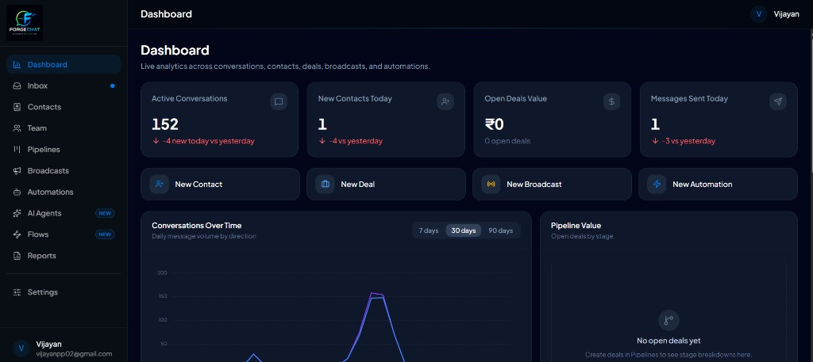
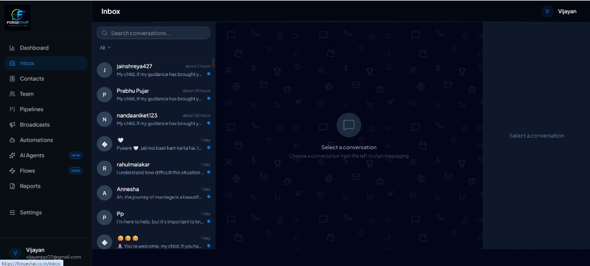

# ForgeChat — WhatsApp Business CRM

> The all-in-one WhatsApp Business CRM for your team — shared inbox,
> contacts, pipelines, broadcasts, and no-code automations.

[](https://forgechat.co.in/)
[](https://nextjs.org)
[](https://supabase.com)
[](./LICENSE)

## Preview

**Live app:** [https://forgechat.co.in/](https://forgechat.co.in/)

### Dashboard

Analytics across conversations, contacts, deals, broadcasts, and automations.



### Shared Inbox

Team inbox for WhatsApp conversations — assign, search, and reply from one place.



### Automations

Visual no-code builder — trigger on new messages and send automated replies.


## What you get

- **Shared inbox** — Multiple agents on one WhatsApp number. Assign conversations, set statuses, leave internal notes.
- **Contacts** — Tags, custom fields, CSV import, automatic deduplication.
- **Sales pipelines** — Kanban board with deals linked directly to conversations.
- **Broadcasts** — Send Meta-approved templates to contact lists with per-recipient variable substitution and delivery tracking.
- **No-code automations** — Trigger on inbound messages, new contacts, keywords, or schedule. Branches, waits, tags, webhooks. Visual builder.
- **AI Agents** — GPT-4o personas that read conversation history (and customer images) and auto-reply on WhatsApp via Automations.
- **Visual flows** — Drag-and-drop flow editor for complex conversation journeys.
- **Real-time dashboard** — Response times, daily volume, pipeline value, activity feed.
- **Team accounts** — Invite teammates by link, role-based access (owner / admin / agent / viewer), ownership transfer.

## AI Agents

ForgeChat **AI Agents** let you define a custom AI persona (system prompt, tone, and rules) that replies to customers on WhatsApp **automatically** — wired through **Automations**, not as a separate chatbot page.

### What it does

- **Persona-based replies** — Each agent has a name, description, and detailed **persona instructions** (system prompt) so replies match your brand or use case.
- **Conversation-aware** — Before replying, the agent loads recent messages from the thread (configurable limit, default 15) and responds in context.
- **Multilingual** — Replies follow the customer’s language when your prompt allows it (e.g. English, Hindi, Malayalam, Tamil, and mixed language).
- **Image understanding** — Customer **photos** in the thread (e.g. palm images) can be sent to the model for vision-based workflows.
- **WhatsApp delivery** — Generated replies are sent as normal WhatsApp text through your connected Business number; outbound messages are tagged with the agent id for audit.

### How to set it up

1. **OpenAI key** — Set `OPENAI_API_KEY` in `.env.local` (see [.env.local.example](./.env.local.example)).
2. **Create an agent** — Sidebar → **AI Agents** → **New agent**.
   - Optional: start from a **starter template** (e.g. Palm & Tarot Reader, Sales Qualifier).
   - Set **temperature** and **context message limit**.
   - Toggle **Active** when ready.
3. **Test** — On the agent edit page, use **Test reply** with a sample customer message before going live.
4. **Automate** — **Automations** → create or edit a flow → add action **AI Reply** → select your agent.
   - Typical trigger: **New message received** (keyword or all messages).
   - The automation runs the agent, generates a reply, and sends it in the same conversation.

### Starter templates

Built-in templates jump-start common verticals:

| Template | Use case |
|----------|----------|
| **Palm & Tarot Reader** | Spiritual / palm / tarot-style guidance with image analysis and upsell flow |
| **Sales Qualifier** | Friendly lead qualification with discovery questions |

You can edit any template after applying it.

### Permissions & limits

- **Create / edit / delete agents** — Admin+ (RLS on `ai_agents`).
- **Use in automations** — Agents with status **Active** only; draft agents are skipped at send time.
- **Billing** — Agent count may count toward plan limits where enabled (see account usage in Settings when billing is on).

### Example automation flow

```
Trigger: New message received
  → Action: AI Reply (select "Palm & Tarot Reader")
  → Customer receives a WhatsApp reply from your business number
```

Combine with **Wait**, **Condition**, **Send template**, or **Tag** steps for richer journeys.

## Support the project

If ForgeChat helps your team, consider supporting development:

**[Buy me a beer](https://rzp.io/rzp/R03Q3Q4F)** — one-time contribution via Razorpay

Sponsorship helps cover hosting, Meta API costs, and ongoing improvements. Thank you!

## Quick start (development)

See the full guide → **[SETUP.md](./SETUP.md)**

```bash
git clone <your-repo-url>
cd agentforge
npm install
cp .env.local.example .env.local   # fill in credentials
npm run dev
```

Open [http://localhost:3000](http://localhost:3000).

## Stack

| Layer | Technology |
|---|---|
| Framework | Next.js 16 (App Router), React 19, TypeScript |
| Styling | Tailwind CSS v4, shadcn/ui |
| Database | Supabase (Postgres + Auth + Storage + RLS) |
| WhatsApp | Meta Cloud API (WhatsApp Business) |
| AI | OpenAI GPT-4o (agents, reply suggestions, inbox assist) |
| Flow editor | React Flow (@xyflow/react) |
| Charts | Recharts |

## Documentation

| Document | Description |
|---|---|
| [SETUP.md](./SETUP.md) | Complete setup and deployment guide |
| [PRODUCT.md](./PRODUCT.md) | Full product feature documentation |
| [.env.local.example](./.env.local.example) | All environment variable reference |

## License

[MIT](./LICENSE)
